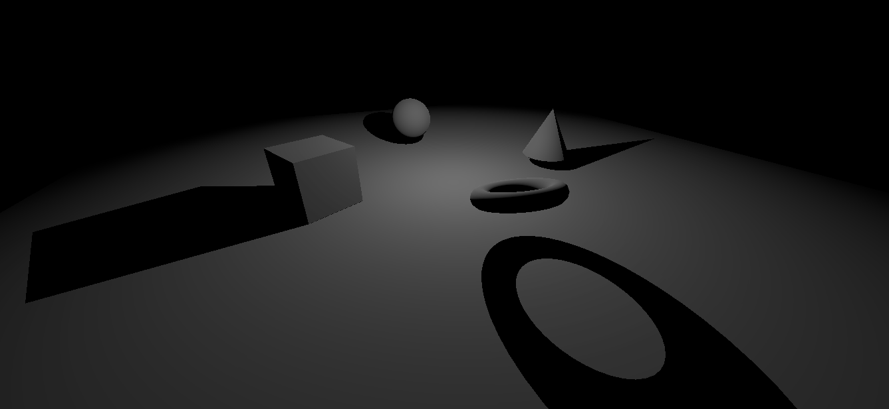

# Godot-fake-stencil-shadows
**It’s just a masking technique, there’s no volume generator.**

Stencil-like shadows based on alpha blending (You can create shadow-volume without Stencil-buffer operations)

This requires a complex material of 4 shaders.

## **Tested renderers:**

**Forward + :** Most likely works on any hardware
  
  **Compatibility :** May work when render_priority is balanced – [-1, 0, 1, 0] *(Only works on some graphics cards)*
  
  **GLES 3 (Godot 3) :** Works but probably depends on the hardware
  
  **GLES 2 :** It’s not working

## **Tested hardware:**

  [Intel HD 4000] : Forward+, ~~Compatibility~~, GLES 3
  
  [Quadro M1000M]: Forward+, Compatibility, GLES 3
  
  [Radeon R5 (Stoney Ridge)]: Forward+, ~~Compatibility~~, GLES 3
  
# 
It looks like the **Compatibility** render contains bugs in the implementation, I don’t recommend using it with this technique.

It may depend on your hardware, so if you tested and it didn’t work for you, please post your hardware in the comments.

